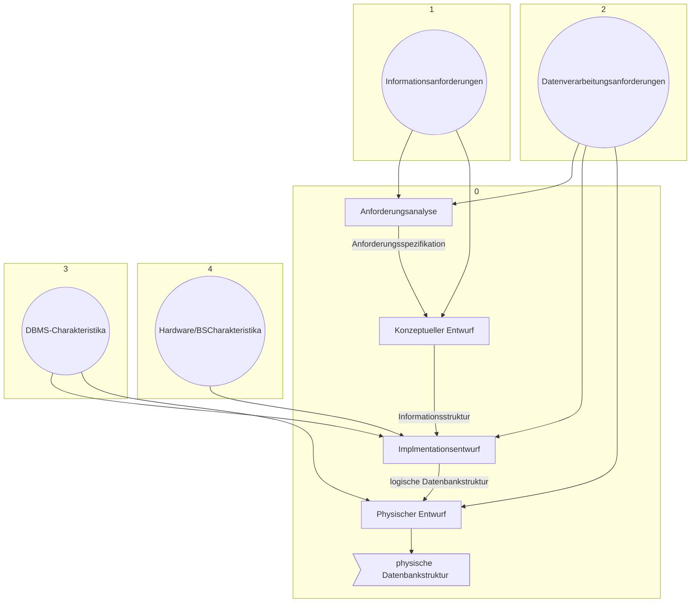

#### Logisches Datenmodelle:
- Netzwerkmodell
- Hierarchises Datenmodell
- Relationales Modell
- XML Schema (JSON)
- Objektorientertes Datenmodell
- Deduktives Datenmodell 

#### Phasen des Datenbankentwurfs:

#### Anforderungsanalyse:
1. Identifikation von Organisationseinheiten
2. Identifikation der zu unterstützenden Aufgaben
3. Anforderungs-Sammelplan
4. Anforderungs-Sammlung
5. Filterung
6. Satzklassifikationen
7. Formalisierung

# Links: 

202410161009
[[2024-10-16]]