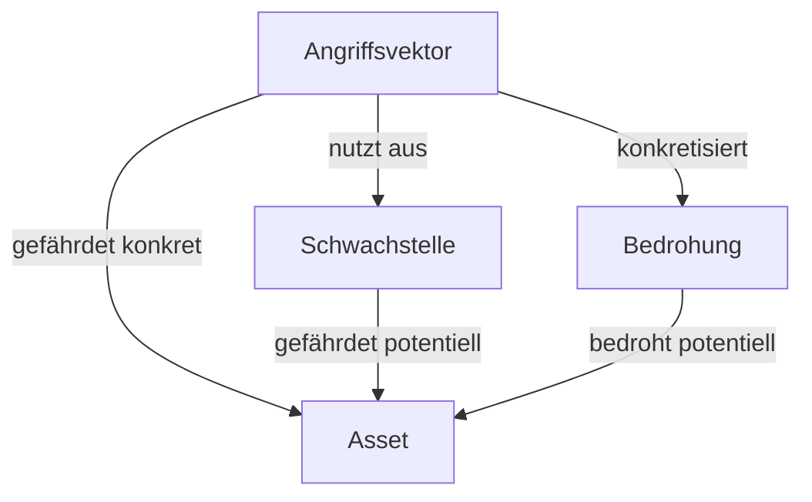

### Schwachstelle, Bedrohungen, angriffe

#### 1.1 Security und safety

(1) Security: Daten und Informations-Sicherheit: ISO 2382-1:
- Verwundbarkeit von zu schützenden Werten systematisch reduzieren!
- Bewahren eines Systems vor Beeinträchtigung und Missbrauch durch Angriffe!
$\textbf{\textcolor{skyblue}{Zu schützenden Werte}}\implies$ Rezeptur in Coca Cola u.s.w.
$\textbf{\textcolor{skyblue}{Schutzmaßnahmen}}\implies$ Verschlüsselung, Zugriffskontrolle u.s.w.

#### $\textbf{\textcolor{skyblue}{Angriffe}}$ 
- Störungen von Außen mit dem Ziel der Daten-Manipulation, des Informationsmissbrauchs oder der Funktionsstörung.
Bespiel: Knacken des Passworts für den Account von Alice z.B über $\textbf{\textcolor{skyblue}{Phishing}}$ z-b fake Login-Seite oder durch $\textbf{\textcolor{skyblue}{Brute Force (Ausprobieren)}}$.   
 
(2) Safety: Funktions- und Betriebssicherheit
- Störungen können von Innen kommen. Man muss Störungen erkennen!
- Maßnahmen, um Störungen zu behandeln! z.B abschalten

#### 1.2 Wichtige Begriffe und ihre Zusammenhänge 
- Asset: zu schützendes Gut, z.B. Passwort.
- Schwachstelle (vulnerability): z.B die Nutzung schwacher Passworte wird nicht verboten.
- Bedrohung (threat): Potenzial, die Sicherheit von Assets zu beeinträchtigen. z.B. Unbefugter kann sich mit geknacktem Passwort anmelden
- Angriff bzw. Angriffsvektor (attack vector): Möglicher Angriffsweg, der eine oder mehrere Schwachstellen ausnutzt. z.B. Knacken des schwachen Passworts mittels Brute Force. Login unter der Kennung Alice mit korrektem Passwort. 


#### 1.3 Angriffsklassen 
 **(1)Ungenügende Eingabe-(und Ausgabe) Validierung.**
 - Eingabe/Ausgabedaten werden nur unzureichend geprüft bzw. bereinigt.
**Beispiel 1**: $\textbf{\textcolor{skyblue}{Buffer-Overflow}}$ 
- Schreiben außerhalb des Speicherbereichs, der für die Speicherung des Wertes einer Variable vorgesehen ist.
- $\textbf{\textcolor{skyblue}{Mögliche Effekte}}$ bei Erfolg:
	- Ändern von Daten, Programm-Crash, unerlaubte Zugriff
**Beispiel 2:** $\textbf{\textcolor{skyblue}{Code-Injection}}$: Nicht validierte Daten werden von einem Interpreter als Bestandteil einer Anfrage verarbeitet, um z.B. Kommandos auszuführen oder die Semantik zu verändern z.B. Code injection --> SQL-Injection Attack

**Basis:** SQL-Datenbank mit Daten von Nutzern 
- Über Queries können Abfragen an die Datenbank gestellt werden.
- Beispiel-Anfrage: Aus Datei "users" sollen Daten des Nutzers mit Identität "id" ausgegeben werden. select* durchsucht alle Spalten. 
```SQL
$query = "SELECT * FROM users WHERE id = "$id"";
```
**Angriff:** 
```SQL 
$id = "1' OR 1=1 --"
```
**z.B. Code Injection*** über Cross-Site-Scripting (XSS)
- Angreifer bringt Javascript Code in Webseite des Servers S ein.
- Ausführung erfolgt im Browser des Opfer-Rechners von Alice.

**(2) Angriffsklasse Identitätsdiebstahl:**
Schwachstellen unter einer fremden Identität (Maskierung, Spoofing) zu agieren:
**Beispiele:** ARP-Spoofing, IP-Address-Spoofing, gespoofte E-Mail-Absenderadressen
**Angriffsvektor:** häufig Man-in-the Middle Angriff als Ausgangspunkt Szenario verdeutlicht das Prinzip.

**(3)Angriffsklasse: Angriffe auf die Verfügbarkeit**
- (Distributed) Denial of Serivce((D)DoS):
	Absichtlich herbeigeführte Überlast z.B. von Servern, Routern

**(4) Angriffsklasse Mensch**
- Social Engineering

**(5) Angriffsklasse Web-Application Security: OWASP Top 10**
Platz2: Fehlerhafte oder fehlende Nutzung von Krypto
# Links: 


202410151056
[[2024-10-15]]